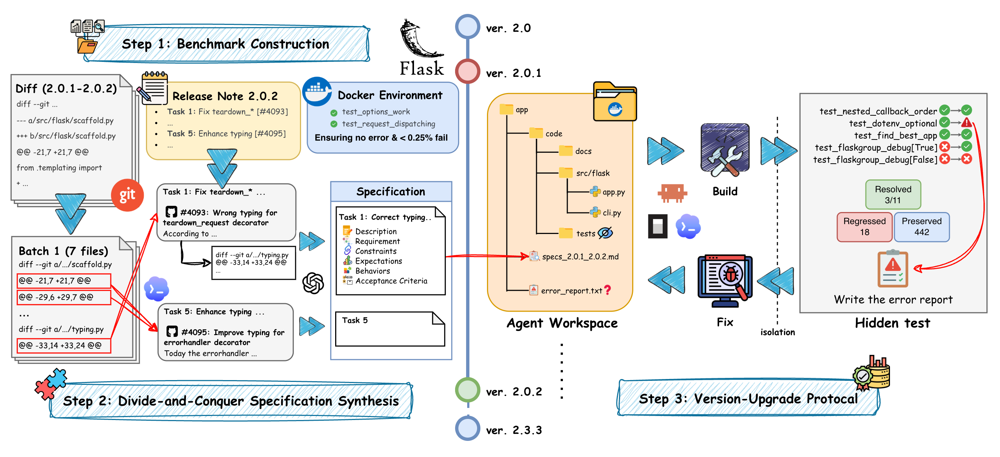

# SWE-Chain: Benchmarking Coding Agents on Continuous Package Version Upgrades



## 🧠 Introduction
SWE-Chain evaluates coding agents (Claude Code, OpenCode, Codex) on multi-step package version upgrades. An agent receives upgrade specs for consecutive version pairs (e.g. Flask 2.0.0 → 2.0.1 → ... → 2.3.3) and must implement each step inside a Docker-isolated environment. Results are scored against the target version's test suite.


## 🚀 Quickstart

```bash
# 1. Install
pip install -r requirements.txt

# 2. Pull dataset (specs + oracle test results) from Hugging Face
python load_dataset.py

# 3. Authenticate the agent CLI you'll use (one-time, on the host) - see below.

# 4. Run the agent over an upgrade chain
bash run.sh data/flask_2.0.0_to_2.3.3_specs_chain.jsonl claudecode anthropic claude-sonnet-4-6 high

# 5. Score the run
bash eval.sh results/flask_2.0.0_to_2.3.3/claudecode-anthropic-claude-sonnet-4-6/chain.json
```

## 🛠️ Agent setup

SWE-Chain supports `Claude Code`, `Codex`, and `OpenCode` CLIs. Is this is the first start, please install the agent CLI you plan to use on the host, login, and tune its settings. Such as specifying the providers throught `/connet` in OpenCode. The runner copies the local credentials/config into it — so whatever works locally will work in the sandbox.

| agent | install + login | what gets copied into the container |
|---|---|---|
| `claudecode` | Install the [Claude Code CLI](https://github.com/anthropics/claude-code), then `claude /login` and export the token: `export CLAUDE_CODE_OAUTH_TOKEN=...` | `CLAUDE_CODE_OAUTH_TOKEN` env var + repo-bundled `agent/claudecode-settings.json` |
| `codex` | Install the [Codex CLI](https://github.com/openai/codex), then `codex login` | `~/.codex/auth.json` and `~/.codex/config.toml` |
| `opencode` | Install [OpenCode](https://opencode.ai), then `opencode auth login` | `~/.local/share/opencode/auth.json` |


## ⚙️ Pipeline

SWE-Chain has four core modules:

| Module | Role | Entry points |
|---|---|---|
| **Collection** | Fetches changelogs and source, extract diffs and per-version test baselines. | `collect.py`, `build.py`, `validate_baseline.py`, `validate_cross.py` |
| **Synthesis** | Matches diff hunks to release-note tasks and synthesizes agent-readable upgrade specs. | `synthesize.py` |
| **Generation** | Runs an agent step-by-step through a chain inside Docker. | `run.sh` → `generate/chain.py` |
| **Evaluation** | Replays each step's diff, runs the target's test suite, scores resolved/regressed/recovered nodes. | `eval.sh` → `evaluation/` |

## 📊 Scoring

For each upgrade step `v_prev → v_next`, we run `v_next`'s test suite against the agent's `prev` and `curr` codebases and classify every baseline-passing test into one of six categories. **Upgrade-related** tests pass on the gold `v_next` codebase but fail/error on the gold `v_prev` codebase — they are the ones the upgrade is supposed to fix.

| Category | Definition |
|---|---|
| **resolved** | An upgrade-related test the agent's current code now passes. |
| **unresolved** | An upgrade-related test the agent's current code still fails. |
| **regressed** | A non-upgrade-related test that passed on the agent's previous step but fails now. |
| **preserved** | A non-upgrade-related test that passed before and still passes. |
| **recovered** | A non-upgrade-related test that was failing on the agent's previous step but now passes. |
| **unrecovered** | A non-upgrade-related test that was failing before and is still failing. |


## 🧪 Customize your own chain

### Setup

1. **`packages.yaml`** — add an entry under `packages:` with the Dockerfile version range, testing folder, exec timeout, and protected paths.
2. **Dockerfile** — drop a Dockerfile under `dockerfiles/` covering the version range declared in step 1.
3. **Changelog fetcher** — write `fetch_<package>_changelog(versions)` in `fetchers/changelog_fetcher.py` and register it in `FETCHER_MAP`. You can use the existing fetcher as a template.

### Build the chain

```bash
# 1. Collect metadata: release notes, GitHub PR/issue content, code & test diffs.
python collect.py flask --from 2.0.0 --to 2.3.3
# → metadata/flask_2.0.0_to_2.3.3/

# 2a. Build a Docker image per version.
python build.py metadata/flask_2.0.0_to_2.3.3

# 2b. Run gold tests on each version (per-version baseline).
python validate_baseline.py metadata/flask_2.0.0_to_2.3.3 --workers 5
# → oracle/flask_2.0.0_to_2.3.3/2.0.1/v2.0.1_test_results.json

# 2c. Run cross-version tests (v_next test suite on v_prev codebase, in v_next image).
python validate_cross.py metadata/flask_2.0.0_to_2.3.3 --workers 5
# → oracle/flask_2.0.0_to_2.3.3/2.0.1/v2.0.0_cross_test_results.json

# 3. Synthesize the agent-readable spec chain.
python synthesize.py metadata/flask_2.0.0_to_2.3.3 --model gpt-5.1 --workers 3
# → data/flask_2.0.0_to_2.3.3_specs_chain.jsonl
```


## 🧩 Repository layout

```
swe-chain/
├── README.md
├── requirements.txt
├── config.py                  # paths, image prefix, per-package YAML accessors
├── packages.yaml              # per-package config (Dockerfile range, timeouts, protected files)
│
├── run.sh                     # entry: agent run over a chain        (Generation)
├── eval.sh                    # entry: replay diffs + score a chain  (Evaluation)
├── compute_all.sh             # entry: re-score every results/ subdir
├── load_dataset.py            # entry: pull dataset from Hugging Face
│
├── collect.py                 # ┐
├── build.py                   # │ Collection: changelogs, sources,
├── validate_baseline.py       # │ Docker images, baseline + cross tests
├── validate_cross.py          # ┘
├── synthesize.py              #   Specification synthesizing
│
├── data/                      # SWE-Chain dataset: per-chain JSONL specs (downloaded from HF)
├── oracle/                    # gold test results per version for evaluation (downloaded from HF)
├── results/                   # agent runs & eval outputs
│
├── agent/                     # CLI wrappers for claudecode / codex / opencode
├── generate/                  # chain runner, hidden-check, build+fix loop
├── evaluation/                # replay diffs for offline evaluation, cross-tests runner, compute metrics
├── validation/                # Docker container + cross-test runner
├── parsers/                   # diff / AST utilities for diffs extraction
├── synthetic/                 # Divide and Conquer Synthesis Pipeline (matching → conquer → completing)
├── fetchers/                  # changelog + package source fetchers
├── dockerfiles/               # per-package, per-version-range Dockerfiles
└── prompts/                   # Jinja2 templates for the agent
```
